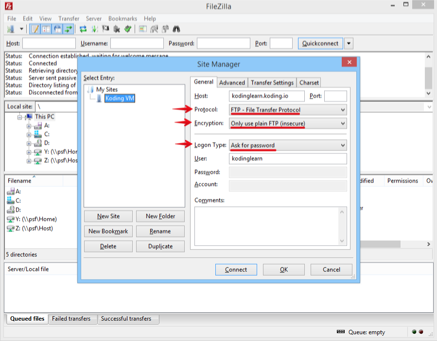
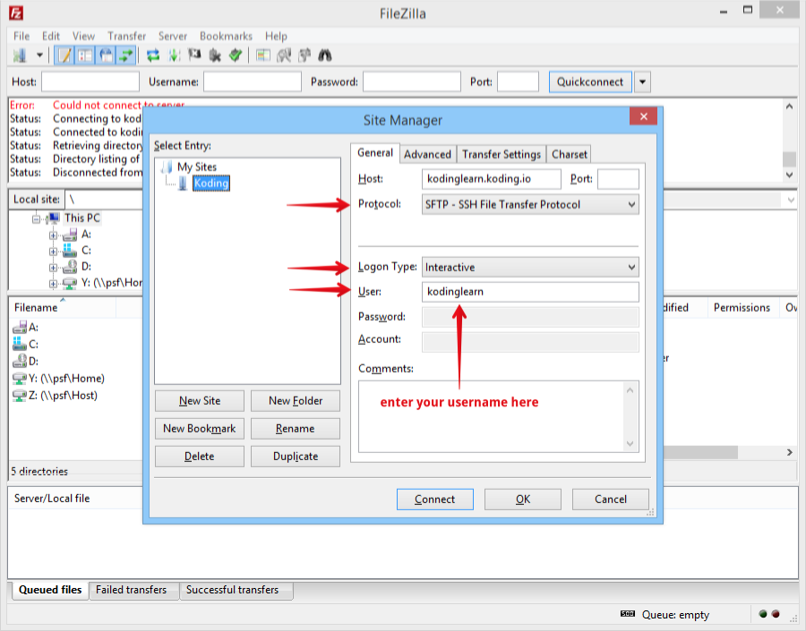

[FileZilla](https://filezilla-project.org/) is a popular FTP client and is widely used
on Windows OS. It's extremely easy to use FileZilla to connect to your VM. This guide
will cover two methods of connecting:
1. Using general connection settings
2. Using a secure connection

> type:error
> Before continuing, please ensure that FTP is set up and running on your VM. If you 
> have not yet set up FTP, follow the instructions on this [guide](http://learn.koding.com/guides/setting-up-ftp-on-koding/) to set it up before
> proceeding.

### Setting up a generic connection to your Koding VM using FileZilla.

As the images below show, its very easy to connect to your Koding VM using the standard
username and password that you created while setting up FTP on your VM.




### Setting up a secure FTP connection to your FTP
To have FileZilla connect with your VM using secure (SFTP), you will need to add your
private key(s) to the FileZilla application. You will also need to add your public key
to the `authorized_keys` file on your VM. If you have not yet set up the
`authorized_keys` file in your `.ssh` directory of your VM, then please [read this guide](http://learn.koding.com/guides/ssh-into-your-vm/#adding-to-your-authorized-keys) before continuing.
> type:error
> Without setting up the above mentioned file, you will get
> connection errors when connecting over SFTP.

With your public key added to the `authorized_keys` file, you can now set up
FileZilla with your **private key** and easily connect to your VM.

Within the FileZilla preferences, find the SFTP section and add your **private key** as
shown in the image below.


Once the file is accepted by FileZilla, you can go back to the host setup and change the settings
to connect using SFTP (as shown in the image below).



### Connection errors and how to fix them
If you get the error below while trying to connect, please check your public and private keys. 
SSH key setup is very tempramental and even an extra space or line break can render the keys useless
which in turn will cause connection problems.
```
Status: Connecting to your_koding_username.koding.io...
Response: fzSftp started, protocol_version=2
Command: keyfile "path_to_your_key_file"
Command: open "xxxxxxx@your_koding_username.koding.io" 22
Command: Trust new Hostkey: Once
Error: Disconnected: No supported authentication methods available (server sent: publickey)
Error: Could not connect to server
```
