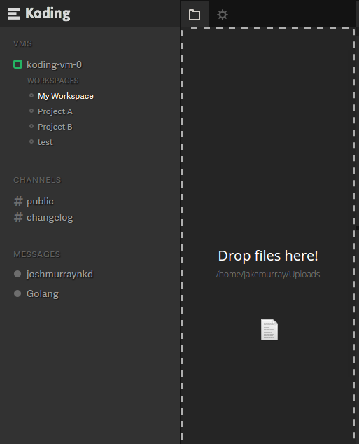

# File Uploads

In this guide we'll take a look at uploading your files and projects to
[Koding][koding], in multiple ways. Lets get started!


## Uploading with Drag and Drop

The simplest way, is simply by using Drag and Drop file upload! To do
this, open your [Koding IDE][ide], locate your FileTree on the left hand
side, and drag a file from your Desktop onto the FileTree. An example
image is below.

> type:tip
> You can only upload files up to 100MB at one time. A file over 100MB will not be 
> allowed for upload via this method. If yo have larger files, you should use the 
> FTP upload method described below.



After you let go of the file, your file will be uploaded to your
`~/Uploads` directory. If `~/Uploads` does not exist, it will be automatically
created.

> type:tip
> Files uploaded this way are not automatically available for
serving over your VMs web server as the `~/Uploads` directory is not inside
`~/Web` (the default web root for Koding VMs). If you wish to use any uploaded
files in your web project, please move them to a directory under `~/Web`.

## Uploading with FTP

FTP is another common way to upload files to your VM. Before uploading
with FTP though, you'll need to set up an FTP Server on your VM.

The [FTP Guide][ftp] will take you through both the installation, and
connecting process, so [check it out!][ftp]

## Uploading with SCP

SCP is is a tool that will copy files from your local **Unix** filesystem
to a remote filesystem over SSH connections. To use it, make sure you
have SSH setup with your Koding VM beforehand. Instructions can be [found
here][ssh] if needed.

After that, use the following command to copy a local file to your VM.

```
scp LOCAL_FILE USERNAME.koding.io:REMOTE_FILE
```

Replace `LOCAL_FILE` with your local file location, `USERNAME` with your
Koding Username, and `REMOTE_FILE` with your Remote File location. An
example of this command can be seen below.

```
scp ~/my_image.png joshmurray.koding.io:~/my_image.png
```


[koding]: https://koding.com
[ide]: https://koding.com/IDE
[ftp]: /guides/setting-up-ftp-on-koding/
[ssh]: /guides/ssh-into-your-vm/
