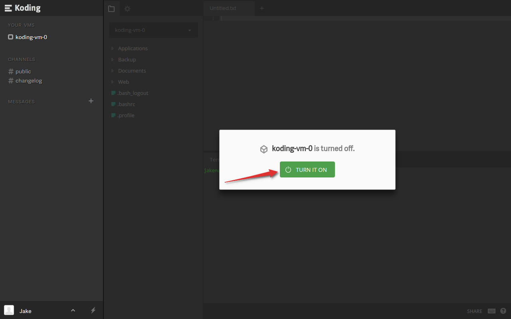
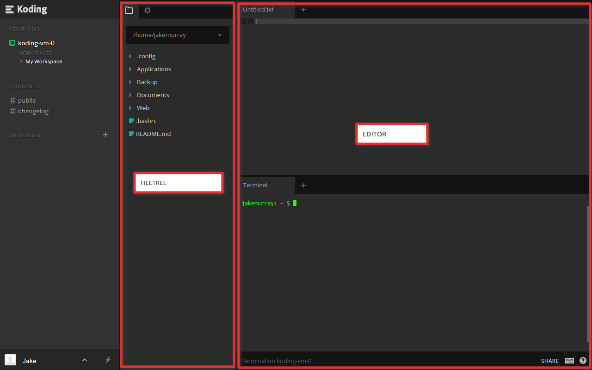

# Koding IDE Introduction

In this guide we’ll go over the Koding Integrated Development Environment or IDE for short. We'll try to explain how it works, how to use it and in end share some useful tips to be more productive.

## Getting started

To access your IDE, select your Virtual Machine on the left hand side as pictured bellow.

> type:warning
> If you have a Developer or Professional account then select the VM you want to start, from the list.

Then click on the `Turn it on` button in the modal.

After your VM is started, you’ll see your Koding IDE.

## Usage

The Koding IDE consists of two main parts. The FileTree, and the Editor.

The FileTree, on the left, enables file navigation around your VM.

Right clicking files and folders yields shortcuts to various actions.

Both the FileTree, and the main navigation sidebar, can be resized by dragging the separator, as seen here. Double clicking the separator will hide the panel.

The FileTree can be resized by dragging the separator, as seen here. Both the FileTree and the main sidebar can be hidden by double clicking the separators.

In the editor, tabs can be opened, split and merged at will. They can also be made full screen.

All of this functionality, and much more, have keyboard shortcuts as well. A shortcut reference, can be located by clicking the keyboard icon in the lower right.

The Koding IDE is a simple, yet powerful, editor for your browser based development.

Explore it today for free, at Koding.com