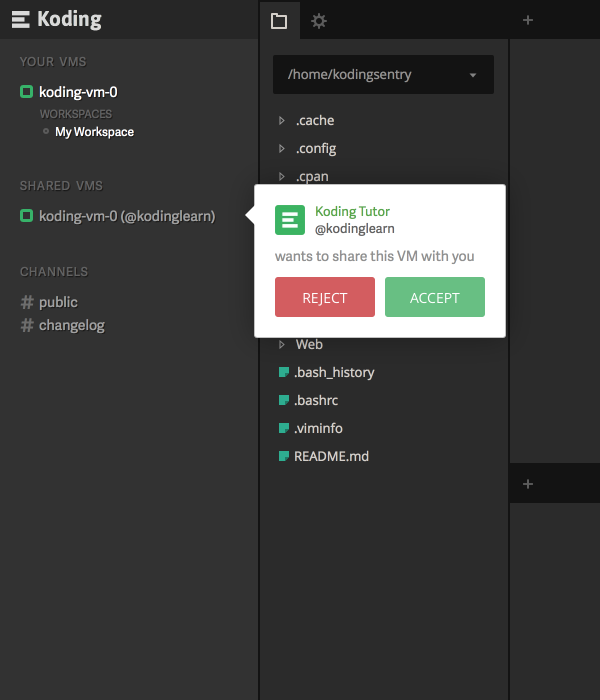
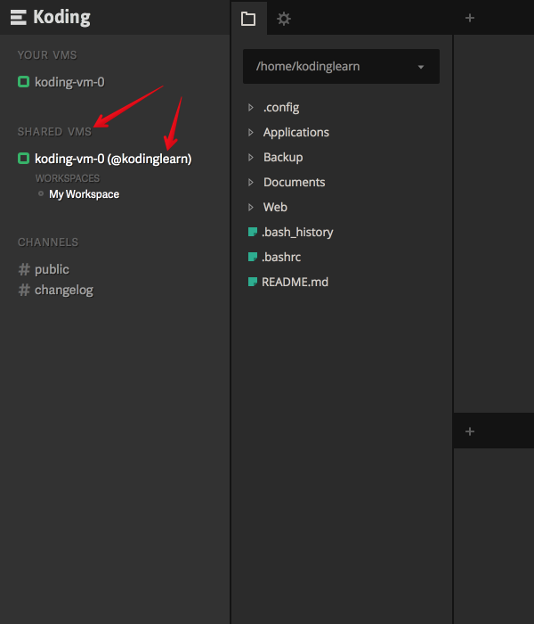
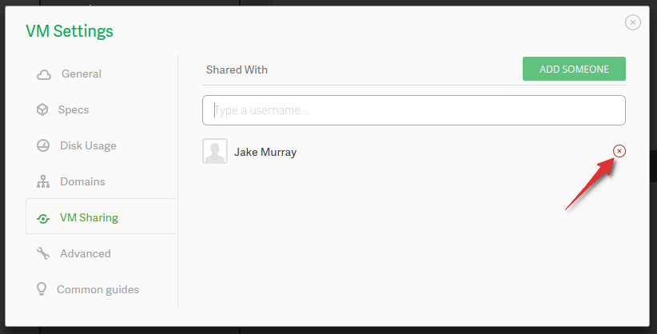
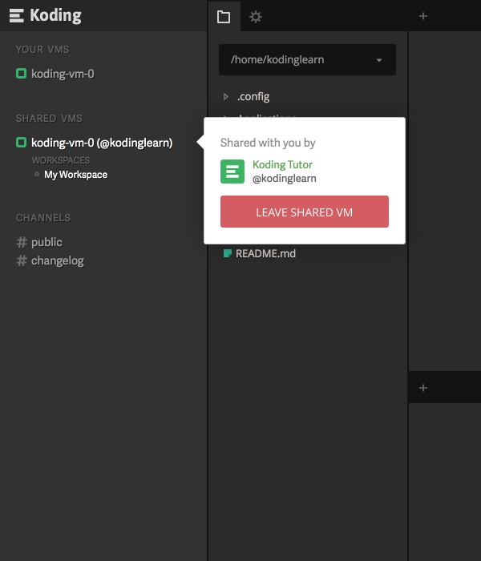

### What does "Shared VM" mean?
The "Share VM" feature allows you to give another Koding user full access to your
VM even if you are not using your Koding.com account. This is very different from
[Collaboration on Koding](/guides/collaboration/) where you are working with someone in
real-time and sharing the IDE and Terminal.

> type:tip
> This feature is only available for accounts with a paid plan (hobbyist, developer or professional).
> Even though a paid account is required to start the sharing, a free account can receive a shared
> VM.

that as a paid plan owner, you can share your VM with another paid or free plan account.
>

### What's the benefit?
There are several use cases where this makes sense. For example:
1. Multiple people are working on a project. They don't need to collaborate real-time but still need to access the same VM independently.
2. A "master" VM has been set up by the team lead that needs to be accessed by many team members (share code, docs, etc.).
3. Team member B needs to take over from team member A because a team is doing "follow the sun" development practice.
4. You are stuck somewhere, cannot be online but need someone else to look at your work.
Can you think of more? If yes, [let us know](mailto:sharedvms@koding.com)!

### How do I share my VM?
1. Head over to VM settings and locate the "Share VM" feature.
2. Click the "+" sign to add the username of a Koding user with whom you wish to share your VM. 
3. The user with whom the VM has been shared will now see an accept/reject notice. 
4. Once they accept, the shared VM will appear in the sidebar as a new avaialble resource. 

### How can I stop sharing my VM?
1. Go into VM settings and remove the user with whom you no longer wish to share your VM. 

### How do I leave a shared VM?
1. Click the VM settings for the shared VM and then select "Leave Shared VM" to remove the VM from your Sidebar.
