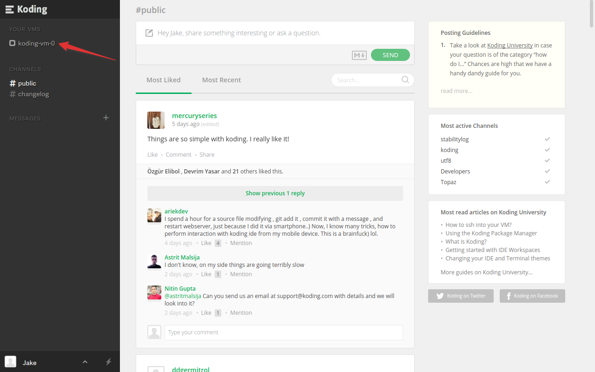

# Koding Terminal Introduction

In this guide we'll go over the Koding Terminal. We'll try to explain how it works, how to use it and in end share some useful tips that you can use to be more productive.

## Getting started

To access a Koding Terminal, select your Virtual Machine on the left hand side as pictured bellow.

> type:warning
> If you have a Developer or Professional account then select the VM you want to start, from the list.

Then click on the `Turn it on` button in the modal.

After the VM has started, you'll see your Koding IDE.

## Usage

After your VM is started, you will see a Terminal prompt in the lower right portion of your Integrated Development Environment. 

With the Terminal, you are able to run commands on your Ubuntu Linux VM. All programs and languages are supported, and you have full sudo access, so you can customize your VM however you want.

The Terminal itself is fast and responsive. Vim, Nano, Tmux and anything else you throw at it, will work right out of the box.

By clicking the plus button next to the Terminal tab, we are able to create multiple Terminals. 

We can also split, merge splits, and even make the terminals Full Screen.

The Koding Terminal is an essential component for development, right in your browser.

Explore it today for free, at Koding.com